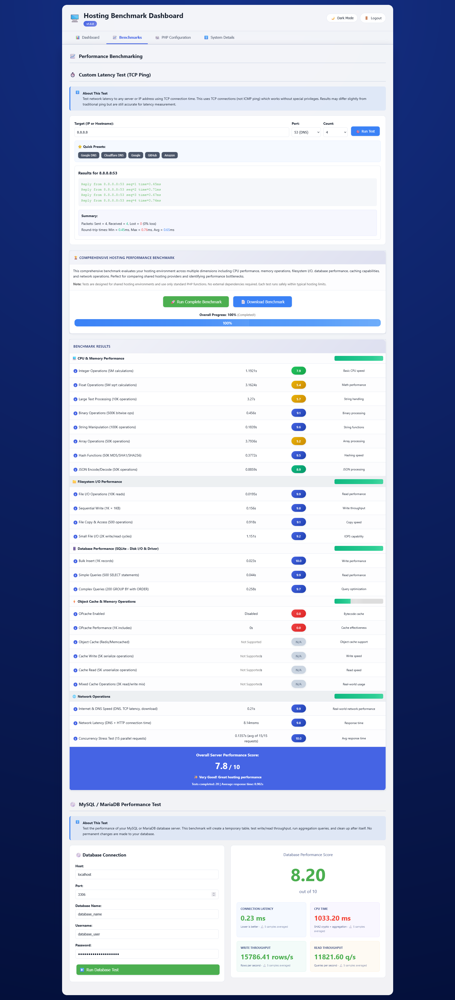

# PHP Shared Hosting Benchmark Dashboard

A lightweight, single-file PHP dashboard designed specifically to benchmark and monitor Shared Hosting environments where you do not have root access or the ability to install system-level monitoring tools.

Just upload the file, and it runs immediately on your existing web hosting server.

## 📋 Requirements

*   **Web Server:** Apache, Nginx, or LiteSpeed.
*   **PHP:** Version 7.4+ recommended.
*   **Standard Extensions:** `json`, `xml`.
    *   *Optional:* `pdo_mysql`, `sqlite3`, `gd` (for full benchmarking suite).

> **Note for VPS/Dedicated Users:** This script does not install PHP for you. If you are using a raw VPS (Ubuntu/CentOS), you must have a web stack (LAMP/LEMP) already installed and configured to serve PHP files.

---

## 🚀 Installation

1.  **Download:** Download `bench.php` from this repository.
2.  **Configure Credentials (MANDATORY):**
    *   Open the file in any text editor.
    *   Find the configuration block near the top (approx line 25).
    *   **Change the default password.** The script has a security lock that prevents it from running until this is changed.

    ```php
    // ============================================================================
    // CONFIGURATION
    // ============================================================================

    $ADMIN_USERNAME = 'admin'; 
    $ADMIN_PASSWORD = 'password'; // <--- Update this!
    ```

3.  **Upload:** Upload the file to your `public_html` or `www` folder using FTP or your hosting File Manager.
4.  **Run:** Visit `http://your-domain.com/bench.php` in your browser.

---



## 🎯 Why use this?

Shared hosting providers often oversell their servers or hide resource usage from you. This tool helps you:
*   **Compare Providers:** Run this on shared hosting plans to see who actually gives you the best CPU and Disk I/O performance.
*   **Verify Resources:** Check if you are actually getting the RAM and CPU cores promised in your plan.
*   **No Root Required:** Works entirely within standard PHP user permissions. No `sudo`, no CLI, and no installation of dependencies required.

## ✨ Features

### 📊 Real-Time System Metrics
*   **System Load:** View load averages (1m, 5m, 15m) even on restricted shells.
*   **Memory Usage:** See real PHP memory limits vs. system RAM (detects swap usage).
*   **Disk I/O:** View storage usage and real-time partition information.
*   **Network:** Live RX/TX traffic monitoring.

### ⚡ Performance Benchmarking
Scores your hosting environment on a scale of 0-10:
*   **Disk Speed:** Tests sequential write and file copy speeds (crucial for cheap shared hosting).
*   **Database (SQLite):** Tests bulk inserts and complex queries to measure filesystem latency.
*   **MySQL/MariaDB:** Connect to your hosting database to test external write/read throughput.
*   **PHP Calculation:** Integer, Float, and Hashing benchmarks to test CPU throttling.
*   **Concurrency:** Simulates parallel requests to see if your host limits simultaneous connections.

### 🛠 Audit Tools
*   **Security Check:** Lists `open_basedir` restrictions and `disable_functions`.
*   **Latency Test:** Built-in TCP Ping tool to check connectivity to external APIs (Google, Cloudflare, etc).
*   **Extension List:** detailed list of all installed PHP extensions and versions.

---

## 📈 Interpreting the Score

The benchmark provides a score from **0 to 10**. Here is how to read it in the context of Shared Hosting:

| Score | Verdict | Description |
| :--- | :--- | :--- |
| **9.0+** | 🏆 **Premium** | Likely a high-performance VPS or premium managed WordPress hosting. |
| **7.0 - 8.9** | ✨ **Great** | Excellent for shared hosting. Good disk I/O and CPU allocation. |
| **5.0 - 6.9** | 👍 **Standard** | Typical budget shared hosting. Good for small/medium sites. |
| **3.0 - 4.9** | ⚠️ **Oversold** | Server is likely crowded. Expect slow database queries and page loads. |
| **< 3.0** | ❌ **Avoid** | Severe throttling or resource limits detected. |

---

## ⚠️ Security

This tool displays sensitive information about your server environment (Kernel version, paths, IP addresses).
*   **Always change the default password.**
*   **Delete the file** when you are finished benchmarking.
*   **Do not** leave this file on a public server permanently.

## Acknowledgements

**Note:** This script was written by LLMs (Gemini and other models).

- **Contact me on LowEndTalk:** https://lowendtalk.com/profile/loay
- **Follow Telegram Channel:** https://t.me/lowendweb

---

## 📄 License

This project is open-source and available under the [MIT License](LICENSE).
